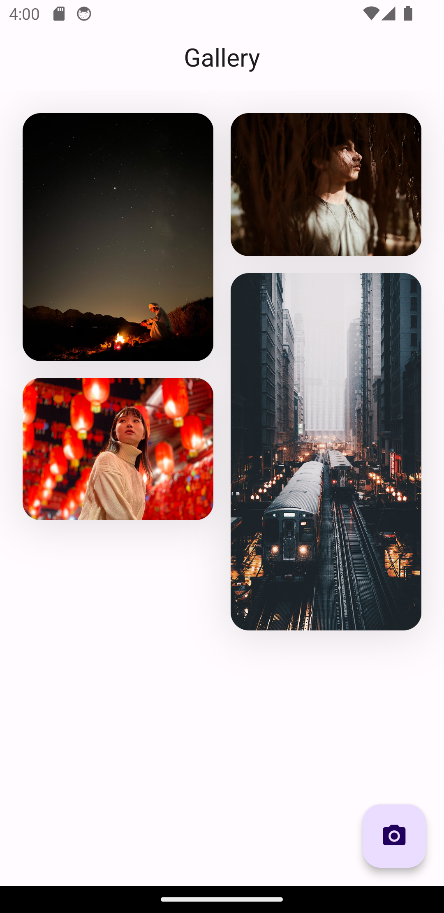
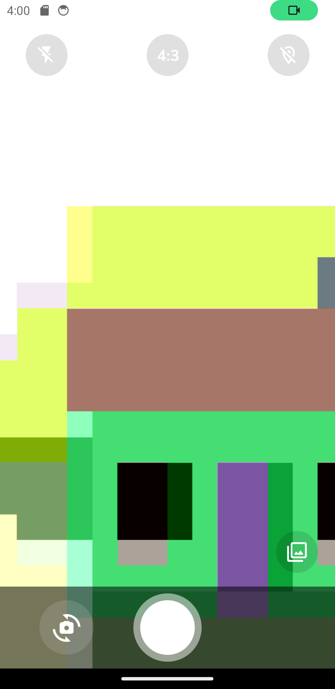
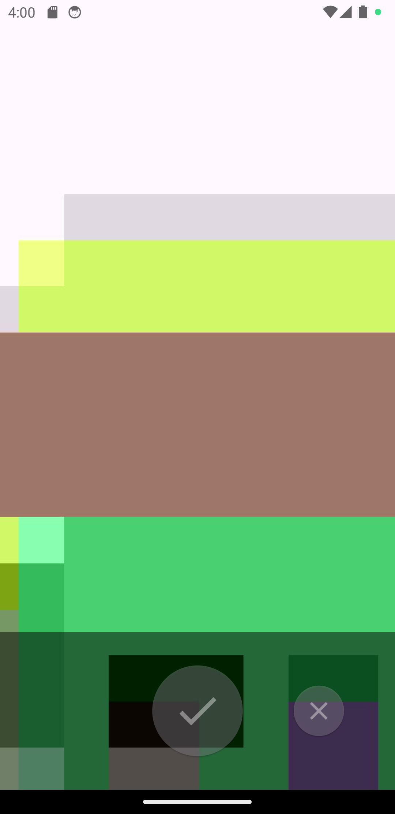
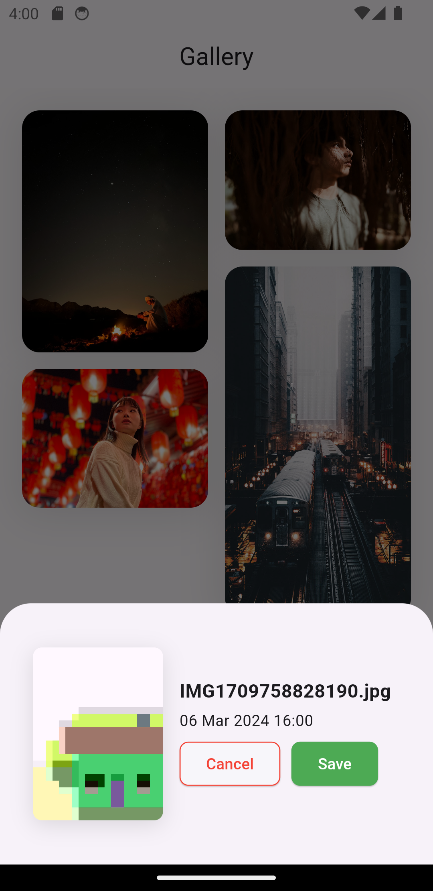

**README**

**Flutter 3.13.6**

This project is a demonstration of how to create a Flutter application using a clean architecture, Riverpod, Firebase, Equatable, and other design patterns and principles.

## Considerations

1. You can find an updated APK in the following folder:

```
resources/app-release.apk
```

## Installation

1. Install Flutter by following the instructions in the official documentation: https://flutter.dev/docs/get-started/install.
2. Clone this repository:

```
git clone https://github.com/carrizomiguel/flutter_riverpod_gallery.git
```

3. Navigate to the project folder:

```
cd flutter_riverpod_gallery
```

4. Install dependencies:

```
flutter pub get
```

## Execution

To run the application in development mode:

```
flutter run
```

To run the application in production mode:

```
flutter run --release
```

## Screenshots

  

 

## Screenshots


## Architecture

### Project Folder Structure
```
├── lib/
|   ├── core/
|   │   ├── app/
│   │   │   ├── views/
│   │   │   └── app.dart
|   │   ├── util/
|   │   ├── error/
|   |   └── core.dart
│   ├── features/
│   │   ├── feature1/
│   │   │   ├── data/
│   │   │   ├── domain/
│   │   │   ├── presentation/
│   │   │   └── feature1.dart
│   │   ├── feature2/
│   │   │   ├── data/
│   │   │   │   ├── data_sources/
│   │   │   │   ├── models/
│   │   │   │   └── repositories/
│   │   │   ├── domain/
│   │   │   │   ├── entities/
│   │   │   │   ├── repositories/
│   │   │   │   └── usecases/
│   │   │   ├── presentation/
│   │   │   │   ├── provider/
│   │   │   │   ├── views/
│   │   │   │   └── widgets/
│   │   │   └── feature2.dart
│   │   └── features.dart
|   ├── firebase_options.dart
|   ├── injector.dart
|   ├── main.dart
│   └── observer.dart
├── pubspec.yaml
└── README.md
```

## Design Patterns and Principles

The application incorporates the following design patterns and principles:

* **Equatable:** This mixin assists in efficiently comparing objects.
* **Clean Architecture:** This architectural pattern aids in designing modular and maintainable applications.

## Others

The application also utilizes the following libraries and tools:

* **Dart:** This programming language is used to develop Flutter applications.
* **Flutter:** This SDK is employed to create mobile, web, and desktop applications using Dart.
* **Flutter DevTools:** This toolkit helps debug and profile Flutter applications.